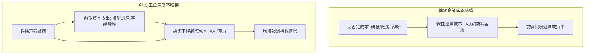

# 動態邊際成本：零複製成本時代的商業邏輯重構

在傳統的工業時代與軟體時代，企業的成長往往受制於邊際成本的遞增或固定。然而，隨著人工智慧技術的突破性發展，我們正步入一個「AI 原生」的新紀元。在這個時代，知識的生成、處理與分發的邊際成本正以驚人的速度趨近於零。這不僅僅是技術的演進，更是商業底層邏輯的徹底重構。許多企業領導者依然用舊有的成本結構模型來評估 AI 專案，導致錯失了指數級增長的機會。本文將深入剖析「動態邊際成本」的概念，並探討企業如何在這個零複製成本時代，重新定義其商業模式、估值邏輯與護城河。

## 痛點導言：傳統成本模型的失效與 AI 時代的焦慮

在當前的商業環境中，企業領導者面臨著前所未有的焦慮。許多企業在導入 AI 技術時，最常遇到的痛點是「投資回報率 (ROI) 難以精確計算」以及「無法將技術優勢轉化為規模化獲利」。傳統的軟體即服務 (SaaS) 模式依賴於高昂的初始研發成本，隨後必須透過大量獲取訂閱用戶來攤提這些固定成本，其邊際成本主要集中在伺服器運算資源的消耗與持續的客戶服務人力投入。在這種模式下，企業的成長曲線往往呈現線性增長，難以突破物理與人力的限制。

但在 AI 原生時代，遊戲規則已經被徹底改寫。當一個經過精細微調的 AI Agent 能夠自主完成從市場調查、文案撰寫、圖文生成到多渠道客戶溝通的全流程時，企業每新增一個服務對象或處理一筆新訂單的成本，幾乎只剩下微乎其微的 API 呼叫費用或本地算力消耗。這種邊際成本的斷崖式下跌，雖然為企業帶來了降低營運費用的希望，但也同時引發了更深層的戰略恐慌。因為當技術門檻降低，所有人都能輕易獲取這種低成本的生產力時，原有的競爭優勢將瞬間瓦解。

然而，企業的焦慮在於：如果每家公司都能以極低的成本獲取強大的 AI 能力，那麼企業的護城河在哪裡？如果競爭對手也利用 AI 將服務成本降至冰點，我們該如何維持產品的溢價與利潤率？這些問題的核心，在於我們尚未建立一套適應「動態邊際成本」的商業邏輯與估值模型。我們必須從根本上理解，當邊際成本不再是固定的線性增長，而是呈現非線性的動態下降時，企業的營運、定價與競爭策略必須發生典範轉移。

## 動態邊際成本的核心機制與演進軌跡

要理解動態邊際成本，我們必須先回顧成本結構的演進歷史。在實體製造業，邊際成本包含原物料、勞動力與運輸，每多生產一件產品，成本就會線性增加。到了網際網路與軟體時代，數位產品的複製成本降至極低，這造就了科技巨頭的崛起。然而，軟體時代的「服務」與「客製化」依然需要大量人力介入，這部分的邊際成本並未消失。

進入 AI 原生時代，我們迎來了「認知勞動力」的零複製成本。一個訓練有素的 AI 模型，可以同時為百萬名用戶提供高度客製化的顧問服務，其增加的成本僅為算力消耗。更重要的是，這種邊際成本是「動態」的：隨著硬體算力的提升、模型演算法的優化以及開源生態的繁榮，單位運算成本正在以摩爾定律甚至更快的速度下降。

這種動態下降的特性，使得企業能夠在過去認為無利可圖的長尾市場中尋找新的商業模式。例如，過去只有高淨值客戶才能負擔的專屬理財顧問服務，現在可以透過 AI Agent 以極低的成本普及到一般大眾。這就是動態邊際成本帶來的市場重構力量。

## AI 原生企業的成本結構架構圖

為了更直觀地理解這種轉變，我們可以使用以下架構圖來比較傳統企業與 AI 原生企業的成本結構差異：



從架構圖中可以看出，AI 原生企業的核心優勢在於「數據飛輪效應」與「動態下降邊際成本」的結合。隨著用戶數量的增加，系統收集到更多的數據，這些數據進一步優化了模型，使得服務品質提升，同時單位算力成本下降，進而吸引更多用戶，形成一個正向循環。

## 商業模式重構：從「賣軟體」到「賣結果」

在動態邊際成本的強大驅動下，傳統軟體行業的商業模式正在經歷一場根本性的板塊重組。過去十年間佔據主導地位的 SaaS 模式，本質上是「賣軟體」或「賣生產力工具」。客戶在支付了高昂的訂閱費用後，獲得的僅僅是一個數位工作區，他們仍需要投入大量的內部人力去學習、操作並維護這些軟體，才能將其轉化為實際的商業價值。這種模式將最終的執行風險與人力成本轉嫁給了客戶。

然而，在 AI 原生時代，當機器的認知能力足以勝任複雜的決策與執行時，企業的價值主張將發生典範轉移：從提供工具，轉向直接「賣結果」或「賣工作完成度」 (Job-to-be-Done)。既然 AI 能夠以極低的邊際成本、24 小時不間斷地完成繁瑣的任務，客戶為何還要花錢買一個需要自己動手操作、甚至還需要培訓員工的半成品工具？

未來的商業模式將不可避免地走向按結果計費 (Outcome-based Pricing) 的終極型態。例如，一個專注於 B2B 領域的行銷 AI Agent 服務商，將不再向客戶收取每月固定的軟體授權費，而是根據該系統實際為客戶挖掘到的有效潛在名單 (Qualified Leads) 數量、甚至是最終促成的交易轉換率來抽取佣金。這種模式的轉變，雖然將執行風險轉移回了服務提供商身上，但也倒逼企業必須對其 AI 系統的效能、精準度與穩定性有著絕對的掌控力。一旦成功建立起這種信任機制，將能徹底鎖定客戶，大幅提高客戶的黏著度與終身價值 (LTV)，並在競爭激烈的紅海市場中開闢出一片利潤豐厚的藍海。

## 具體案例分析：AI 客服系統的動態成本演進

讓我們透過一個具體的案例來驗證動態邊際成本的影響。假設一家中型電商企業決定導入 AI 客服系統來取代部分人工客服。

**傳統人工客服模式：**
*   每位客服月薪：$1,500 USD
*   每位客服每月可處理工單：1,000 件
*   每件工單邊際成本：$1.5 USD

**導入 AI 客服系統 (第一年)：**
*   系統建置與微調固定成本：$50,000 USD
*   每件工單 API 呼叫成本 (GPT-4 等級)：$0.1 USD
*   若每月處理 10,000 件工單，總成本為固定攤提加上變動成本，單件成本大幅下降。

**導入 AI 客服系統 (第三年，動態成本效應顯現)：**
*   隨著開源模型進步與算力成本下降，企業改用本地部署的優化模型。
*   每件工單運算成本降至：$0.01 USD (示意數據，反映算力成本的動態下降)。
*   此時，AI 客服的邊際成本幾乎可以忽略不計。企業甚至可以主動出擊，利用極低成本的 AI Agent 進行個人化的售後關懷與二次行銷，將原本的「成本中心」轉化為「利潤中心」。

| 成本項目 | 傳統人工客服 | AI 客服 (第一年) | AI 客服 (第三年) |
| :--- | :--- | :--- | :--- |
| 固定成本 | 低 (僅設備) | 高 (系統建置) | 已攤提完畢 |
| 邊際成本/件 | $1.5 USD | $0.1 USD | $0.01 USD |
| 服務擴展性 | 線性 (需增聘人力) | 指數級 (增加算力) | 指數級 (極低算力成本) |
| 業務屬性 | 成本中心 | 效率優化中心 | 利潤中心 (主動行銷) |

## 企業實踐：重構護城河的 Prompt 與 SOP

在邊際成本趨近於零的環境下，單純的「技術能力」或「演算法優勢」將不再是堅不可摧的護城河。因為這些技術最終會被開源社群或基礎設施提供商所商品化。企業真正的護城河在於「專有數據」、「領域知識」以及「複雜工作流的整合能力」。

為了幫助企業建立這道護城河，以下提供一個用於萃取領域知識並轉化為 AI Agent 系統指令的 Prompt 範例：

### 領域知識萃取 Prompt

```markdown
**Role**
你是一位資深的企業知識架構師與 AI 系統分析師。

**Task**
請協助我將我們公司在 [填入特定領域，例如：B2B 軟體銷售] 的隱性領域知識，轉化為可以供 AI Agent 執行的結構化規則與決策樹。

**Input Data**
[請在此貼上過去成功案例的對話紀錄、內部 SOP 手冊、資深員工的經驗分享等非結構化資料]

**Output Format**
請以 Markdown 格式輸出，包含以下部分：
1. 核心決策變數：列出在該領域中，影響最終結果的 3-5 個關鍵變數。
2. 狀態機 (State Machine)：描述任務從開始到結束的各個狀態，以及狀態轉換的觸發條件。
3. 異常處理機制：列出常見的邊界情況 (Edge Cases) 以及 AI Agent 應採取的應對策略。
4. 系統提示詞草稿：為負責執行此任務的 AI Agent 撰寫一段 System Prompt。
```

### 建立 AI 護城河的標準作業流程 (SOP)

1.  **盤點高頻且高價值的業務流程**：找出企業內部重複性高，且對營收或客戶滿意度有重大影響的流程。
2.  **數據資產化**：將過去處理這些流程的歷史數據（對話、文件、決策紀錄）進行清洗與結構化。
3.  **微調與領域適應**：利用這些專有數據，對基礎大模型進行微調 (Fine-tuning) 或建立檢索增強生成 (RAG) 系統，使其具備企業專屬的領域知識。
4.  **設計多智能體協作架構**：不要依賴單一的超級 AI，而是將複雜任務拆解，由多個專責的 AI Agent 協作完成（例如：一個負責資料收集，一個負責分析，一個負責撰寫報告）。
5.  **持續的數據飛輪運營**：建立機制，將 AI Agent 在實際運作中產生的新數據與用戶回饋，持續餵回系統進行迭代優化。

## 估值模型的演進與 ROI 重新定義

在動態邊際成本的框架下，傳統的企業估值模型（如現金流折現法 DCF）也需要進行調整。傳統模型往往低估了 AI 技術帶來的非線性增長潛力與成本下降速度。

在評估 AI 專案的 ROI 時，我們不能僅僅計算「節省了多少人力成本」。更重要的是評估「創造了多少新的業務機會」。例如，因為邊際成本降至極低，企業可以開始服務過去因為成本考量而放棄的「長尾客戶」，這部分新增的營收應該計入 AI 專案的 ROI 中。

此外，估值模型中應該引入「AI 準備度」(AI Readiness) 或「數據資產價值」等無形資產的權重。一家擁有大量高質量專有數據，且已經建立起 AI 自動化工作流的企業，其在未來的競爭中將享有巨大的優勢，這應該反映在其估值溢價上。

## 結語＋下一步：擁抱零成本擴張的未來

動態邊際成本的下降，是 AI 原生時代最迷人也最殘酷的商業現實。它摧毀了依賴資訊落差與人力密集型服務的傳統商業模式，同時也為勇於創新的企業打開了無限擴張的大門。企業領導者必須摒棄傳統的線性思維，重新審視自身的成本結構與價值主張。

**下一步行動建議：**
1.  **進行成本結構壓力測試**：假設您的核心服務的邊際成本在未來三年內下降 90%，您的商業模式是否依然成立？您的競爭對手會如何利用這個優勢？
2.  **尋找「結果導向」的定價機會**：審視目前的產品線，評估是否有機會從「按使用量/訂閱收費」轉向「按商業結果收費」。
3.  **加速專有數據的積累**：將數據收集與結構化視為企業的最高戰略優先級，這是建立未來護城河的唯一原料。

在這個零複製成本的時代，未來的贏家將是那些能夠最快將領域知識轉化為 AI 演算法，並利用極低邊際成本在全球範圍內提供卓越「結果」的企業。面對這場由算力與演算法共同推動的工業革命，企業唯一的選擇就是主動重構自身的商業邏輯，將動態邊際成本的紅利轉化為堅不可摧的戰略護城河。只有那些敢於顛覆自我、將營運重心從「管理成本」轉向「創造結果」的領導者，才能在 AI 原生時代的浪潮中乘風破浪，成就下一個十年的偉大企業。

---
*本文為 Manus AI 自動運營體系 L3 藍圖初稿，未經核准請勿直接應用於生產環境。*
